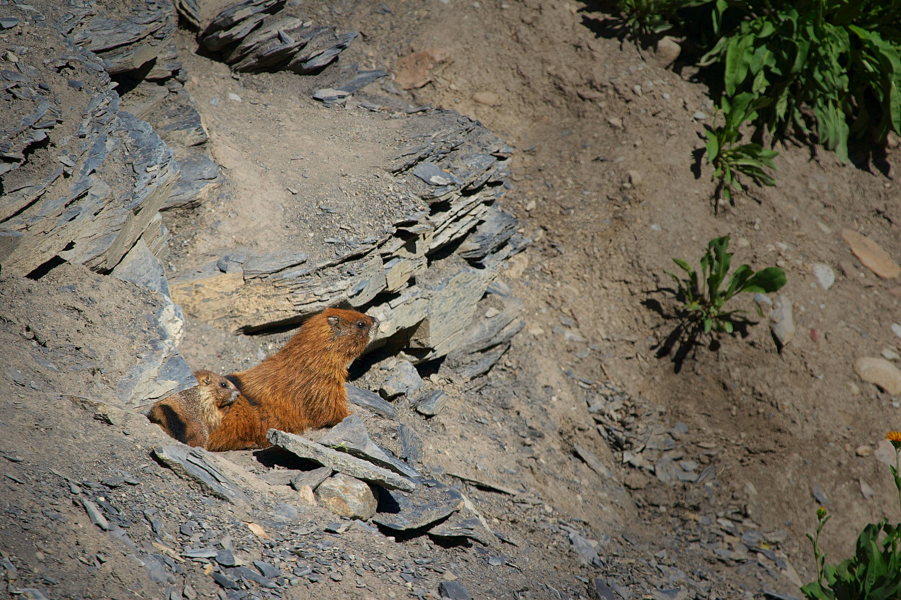

# Project
Life-histories strategies are strongly influenced by environmental conditions and age. To understand the how animals adapt and evolve in natural conditions, it is key to understand how life-history trade-offs vary throughout the life of individuals. The main aim of the project will be to investigate variation in life-history trade-offs with environment age and/or sexes variation using the yellow-bellied marmot long-term study (> 50 years). The richness of the study system will allow the student to further define the project at the beginning of the project.

The project will be supervised by Pr. Julien Martin (uOttawa). The project will be done in collaboration with Pr. Dan Blumstein (UCLA, USA) and the Rocky Mountain Biological Laboratory, RMBL, USA. The student will be based at the Biology department of the University of Ottawa and will participate to field work in Colorado at RMBL during the summer. 

# Financial support
Available for 2 years. The student is expected to complete a minimum of two teaching assistantship per year.

# Starting date

Ideally September 2021 or January 2022

# Candidate Profile
The ideal candidate should have: 

- BSc in biology.
- A strong interest for statistical analyses and R programming.
- The ability to work alone and in teams.
- A willingness to work in French and in English.

# How to apply
Students that are interested should send by email to Julien Martin (julien.martin@uottawa.ca):

- a writing sample (thesis, paper or scientific article),
- a CV, a motivation letter
- the contact of two references
- a copy of their transcripts

