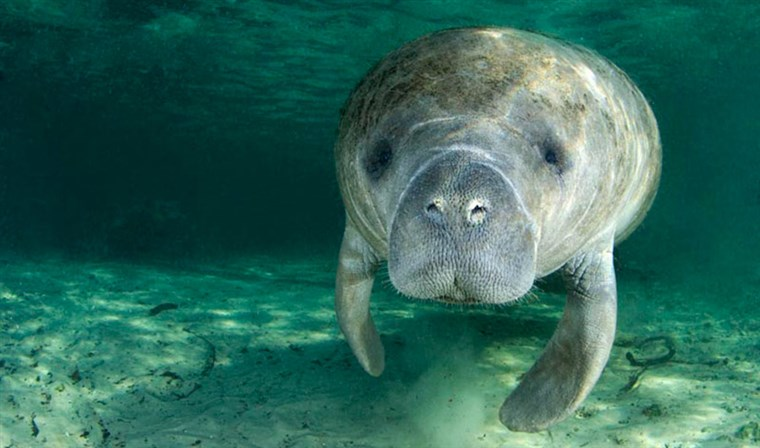

# Project
Using well known population of manatees along the east coast of Mexico, the project will be looking at the variation in foraging behaviour with reproductive status in manatees using a spatial ecology approach based on aerial imaging. Data collection will be done from the shore using aerial imaging from a small UAV (unmanned aerial vehicle).  

The project will be supervised by **Julien Martin** (uOttawa, Canada). The project will be done in collaboration with **Guillaume Rieucau** ([LUMCON, USA](https://www.guillaumerieucau.com/)) and **Nataly Castelblanco-Martínez** ([FINS](https://finsconservation.org/)). The student will be based at the Biology department of the University of Ottawa and will participate to field work in Mexico during the summer. 

# Financial support
Available for 2 years. The student is expected to complete a minimum of two teaching assistantship per year.

# Starting date

Ideally September 2021 or January 2022

# Candidate Profile
The ideal candidate should have: 

- BSc in biology.
- A strong interest for statistical analyses and R programming.
- The ability to work alone and in teams.
- A willingness to work in French and in English.

# How to apply
Students that are interested should send by email to Julien Martin (julien.martin@uottawa.ca):

- a writing sample (thesis, paper or scientific article),
- a CV, a motivation letter
- the contact of two references
- a copy of their transcripts

